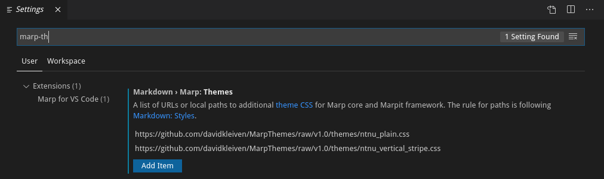
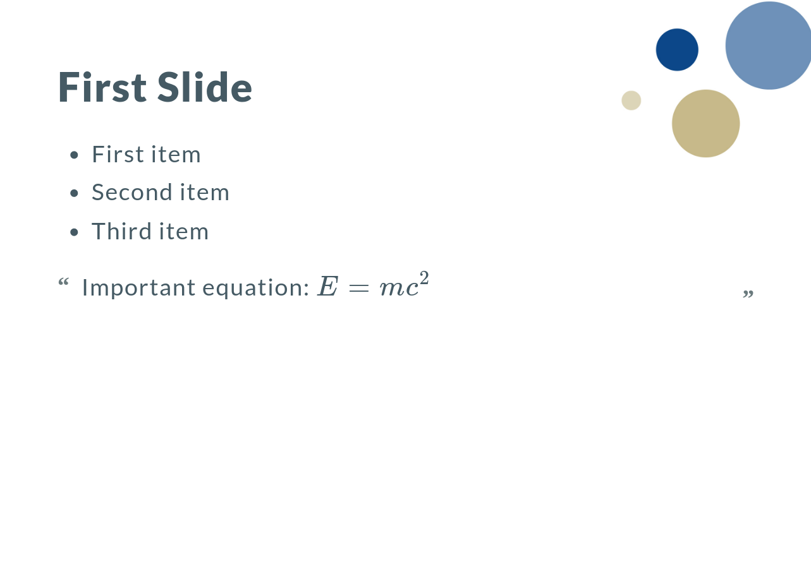

# Usage With VSCode

Clone (or download a zip)  of the repository. Open VSCode and navigate to settings (for example by clicking CTRL+,).
Search for *marp-themes* add then css files for the theme you want by clikcing *Add Item*.

# Implemented Themes

* [ntnu-plain](examples/ntnu_plain.md)

* [ntnu-vertical](examples/ntnu_vertical.md)

